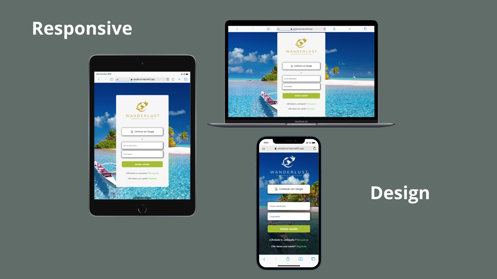

# Creando una Red Social

 
 
 <strong>Colaboradoras :</strong>
 

* [Kelly  Flores](https://github.com/kellyfabiolafc)
* [Marwill Alexa](https://github.com/Alexas1903) 
* [Elisabeth Rojas](https://github.com/ElisabethContreras)

<strong>Demo</strong>

* [Wanderlust](https://wanderlust-kea.netlify.app/)

## Índice
* [1. Wanderlust](#1-wanderlust)
* [2. Resumen del proyecto](#2-resumen-del-proyecto)
* [3. Historias de usuario](#3-historias-de-usuario)
* [4. Consideraciones del comportamiento de la interfaz de usuario (UI)](#4-consideraciones-del-comportamiento-de-la-interfaz-de-usuario-ui)
* [5. Consideraciones técnicas UX](#5-consideraciones-técnicas-ux)
* [6. Objetivos de aprendizaje](#6-objetivos-de-aprendizaje)
## 1. Wanderlust 
### Definición:
<strong>Wanderlust </strong> es una red social de viajes donde los usuarios pueden compartir sus aventuras y descubrir nuevos destinos a través de la experiencia de otros viajeros. La aplicación utiliza la tecnología de Firebase para almacenar y recuperar datos de usuarios y publicaciones.

En <strong>Wanderlust </strong> , los usuarios pueden publicar sus experiencias de viaje y compartir fotos de lugares hermosos que hayan visitado. Además, cuenta con una sección de exploración donde los usuarios pueden ver todas las publicaciones e interactuar con otras publicaciones dando "Me gusta" , también tiene una función de edición para los usuarios que hayan publicado, lo que les permite editar sus publicaciones existentes o eliminarlas por completo.

### Los objetivos generales de este proyecto son los siguientes:

* Desarrollar una SPA con temática de red social
* Aplicar los conceptos de responsividad en el desarrollo de las vistas (templates)
* Implementar un router para la navegación entre las diferentes vistas de la aplicación
* Emplear un servicio externo para la persistencia de datos de la aplicación
* Crear una suite de pruebas unitarias que permitan testear código asíncrono
## 2. Resumen del proyecto
### Encuesta 
Realizar una encuesta nos ayudó mucho porque nos permitió obtener información valiosa sobre las necesidades y expectativas de los usuarios en relación a nuestra red social. Gracias a la encuesta, pudimos recopilar información sobre las características específicas que los usuarios esperaban de nuestra plataforma, su experiencia previa en otras redes sociales y la forma en que interactúan con estas plataformas.

Los resultados de la encuesta también nos ayudaron a definir el enfoque y la estrategia de nuestra red social. Pudimos identificar nuestro público objetivo, definir las características principales de la plataforma y establecer el tono y la voz de la marca. En resumen, la encuesta nos permitió crear una plataforma relevante y útil para los usuarios, reduciendo el riesgo de crear una red social que no tenga éxito debido a la falta de interés o necesidad por parte de los usuarios.

 

### Objetivos :
El objetivo principal de Wanderlust, red social de viajes donde los usuarios pueden compartir sus aventuras y descubrir nuevos destinos a través de la experiencia de otros viajeros, es crear una comunidad de viajeros apasionados por explorar el mundo y compartir sus vivencias.
### Principales usuarios :
Los principales usuarios de esta red social son las personas que disfrutan viajar, descubrir nuevas culturas y tener experiencias únicas. Wanderlust fue creado para personas de diferentes edades, géneros y nacionalidades, pero con una pasión compartida por los viajes.

Además, esta red social podría resultar especialmente atractiva para aquellos que buscan inspiración e ideas para planear sus próximos viajes, así como para aquellos que disfrutan compartiendo sus aventuras con otros y creando una comunidad en línea de viajeros entusiastas. También podrían ser usuarios aquellos que deseen encontrar recomendaciones y consejos de otros viajeros acerca de lugares para visitar, entre otros aspectos relacionados con los viajes.
### Funcionalidad
* Iniciar sesión con correo electrónico y contraseña o cuenta de Google.
* Crear una publicación con texto y una imagen.
* Editar y eliminar publicaciones propias.
* Dar "like" y "dislike" a las publicaciones de otros usuarios.
## 3. Historias de usuario

 

 

### Criterios de aceptación y definición de terminado 

 
 

 

 

###  Diseño de la Interfaz de Usuario (prototipo de baja fidelidad)
Realizar el prototipo de baja del proyecto nos ayudó a visualizar y comprender mejor cómo sería la idea en la práctica. Al crear una maqueta o representación básica del diseño, se pudo evaluar su funcionalidad y hacer ajustes antes de comprometer con la construcción completa.
También pudimos utilizar el prototipo de baja para obtener comentarios y opiniones de posibles usuarios finales. Sus sugerencias y observaciones nos permitieron mejorar y refinar el diseño antes de avanzar a la siguiente etapa del proyecto.

 

###  Responsive

 

* [Responsive design](https://www.canva.com/design/DAFhOPofCyE/duZxRh2iPazl_f1s8Y7oRw/watch?utm_content=DAFhOPofCyE&utm_campaign=share_your_design&utm_medium=link&utm_source=shareyourdesignpanel)

## 4. Consideraciones del comportamiento de la interfaz de usuario (UI)
✔️ **Creación de cuenta de usuario e inicio de sesión**

* _Login_ con Firebase:
  - Para el _login_ y las publicaciones en el muro puedes utilizar [Firebase](https://firebase.google.com/products/database/)
  - Creación de cuenta de acceso y autenticación con cuenta de correo y
    contraseña, y también con una cuenta de Google.
* Validaciones:
  - Solamente se permite el acceso a usuarios con cuentas válidas.
  - No pueden haber usuarios repetidos.
  - La cuenta de usuario debe ser un correo electrónico válido.
  - Lo que se escriba en el campo (_input_) de contraseña debe ser secreto.
* Comportamiento:
  - Al enviarse el formulario de registro o inicio de sesión, debe validarse.
  - Si hay errores, se deben mostrar mensajes descriptivos para ayudar al
  usuario a corregirlos.

✔️  **Muro/timeline**

* Validaciones:
  - Al publicar, se debe validar que exista contenido en el _input_.
* Comportamiento:
  - Al recargar la aplicación, se debe verificar si el usuario está _logueado_
    antes de mostrar contenido.
  - Poder publicar un _post_.
  - Poder dar y quitar _like_ a una publicación. Máximo uno por usuario.
  - Llevar un conteo de los _likes_.
  - Poder eliminar un post específico.
  - Pedir confirmación antes de eliminar un _post_.
  - Al dar _click_ para editar un _post_, debe cambiar el texto por un _input_
    que permita editar el texto y luego guardar los cambios.
  - Al guardar los cambios debe cambiar de vuelta a un texto normal pero con la
    información editada.
  - Al recargar la página debo de poder ver los textos editados.

#### Pruebas unitarias (unit tests)

* Recuerda que no hay un _setup_ de **tests** definido, dependerá de
  la estructura de tu proyecto. Algo que no debes de olvidar es pensar en éstas
  pruebas, te pueden ayudar a definir la estructura y nomenclatura de tu lógica.

* Los tests unitarios deben cubrir un mínimo del 70% de _statements_, _functions_,
  _lines_, y _branches_.

## 5. Consideraciones técnicas UX
✔️ **Hacer seciones de testing de usabilidad con el producto en HTML.**
Cuando lanzamos nuestra red social, queríamos asegurarnos de que ofreciera una experiencia de alta calidad para nuestros usuarios. Por eso, realizamos pruebas rigurosas antes de cada lanzamiento de nuevas funcionalidades y actualizaciones. De esta manera, podemos identificar y corregir errores antes de que afecten a nuestros usuarios.

Además, las pruebas también nos han ayudado a identificar problemas específicos que pueden estar afectando la red social. Por ejemplo, si un gran número de usuarios experimenta problemas al cargar imágenes, podemos identificar la causa y trabajar en soluciones para corregir el problema lo más rápido posible.

Otro beneficio de las pruebas es que nos han permitido mejorar la eficiencia de la red social. Al identificar y corregir problemas de rendimiento, hemos logrado mejorar el tiempo de carga y la velocidad general de la red social, lo que es beneficioso tanto para nuestros usuarios como para nosotros.

Por último, las pruebas también nos han ayudado a planificar a largo plazo. Al recopilar información sobre cómo los usuarios interactúan con la red social, podemos identificar áreas que necesitan mejoras y desarrollar nuevas funcionalidades y características que satisfagan las necesidades de nuestros usuarios.

 

## 6. Objetivos de aprendizaje
### HTML

- [ ] **Uso de HTML semántico**

  

Links

  * [HTML semántico](https://curriculum.laboratoria.la/es/topics/html/02-html5/02-semantic-html)
  * [Semantics - MDN Web Docs Glossary](https://developer.mozilla.org/en-US/docs/Glossary/Semantics#Semantics_in_HTML)

### CSS

- [ ] **Uso de selectores de CSS**

  

Links

  * [Intro a CSS](https://curriculum.laboratoria.la/es/topics/css/01-css/01-intro-css)
  * [CSS Selectors - MDN](https://developer.mozilla.org/es/docs/Web/CSS/CSS_Selectors)

- [ ] **Modelo de caja (box model): borde, margen, padding**

  

Links

  * [Box Model & Display](https://curriculum.laboratoria.la/es/topics/css/01-css/02-boxmodel-and-display)
  * [The box model - MDN](https://developer.mozilla.org/en-US/docs/Learn/CSS/Building_blocks/The_box_model)
  * [Introduction to the CSS box model - MDN](https://developer.mozilla.org/en-US/docs/Web/CSS/CSS_Box_Model/Introduction_to_the_CSS_box_model)
  * [CSS display - MDN](https://developer.mozilla.org/pt-BR/docs/Web/CSS/display)
  * [display - CSS Tricks](https://css-tricks.com/almanac/properties/d/display/)

- [ ] **Uso de flexbox en CSS**

  

Links

  * [A Complete Guide to Flexbox - CSS Tricks](https://css-tricks.com/snippets/css/a-guide-to-flexbox/)
  * [Flexbox Froggy](https://flexboxfroggy.com/#es)
  * [Flexbox - MDN](https://developer.mozilla.org/en-US/docs/Learn/CSS/CSS_layout/Flexbox)

- [ ] **Uso de CSS Grid Layout**

  

Links

  * [A Complete Guide to Grid - CSS Tricks](https://css-tricks.com/snippets/css/complete-guide-grid/)
  * [Grids - MDN](https://developer.mozilla.org/en-US/docs/Learn/CSS/CSS_layout/Grids)

### Web APIs

- [ ] **Uso de selectores del DOM**

  

Links

  * [Manipulación del DOM](https://curriculum.laboratoria.la/es/topics/browser/02-dom/03-1-dom-methods-selection)
  * [Introducción al DOM - MDN](https://developer.mozilla.org/es/docs/Web/API/Document_Object_Model/Introduction)
  * [Localizando elementos DOM usando selectores - MDN](https://developer.mozilla.org/es/docs/Web/API/Document_object_model/Locating_DOM_elements_using_selectors)

- [ ] **Manejo de eventos del DOM (listeners, propagación, delegación)**

  

Links

  * [Introducción a eventos - MDN](https://developer.mozilla.org/es/docs/Learn/JavaScript/Building_blocks/Events)
  * [EventTarget.addEventListener() - MDN](https://developer.mozilla.org/es/docs/Web/API/EventTarget/addEventListener)
  * [EventTarget.removeEventListener() - MDN](https://developer.mozilla.org/es/docs/Web/API/EventTarget/removeEventListener)
  * [El objeto Event](https://developer.mozilla.org/es/docs/Web/API/Event)

- [ ] **Manipulación dinámica del DOM**

  

Links

  * [Introducción al DOM](https://developer.mozilla.org/es/docs/Web/API/Document_Object_Model/Introduction)
  * [Node.appendChild() - MDN](https://developer.mozilla.org/es/docs/Web/API/Node/appendChild)
  * [Document.createElement() - MDN](https://developer.mozilla.org/es/docs/Web/API/Document/createElement)
  * [Document.createTextNode()](https://developer.mozilla.org/es/docs/Web/API/Document/createTextNode)
  * [Element.innerHTML - MDN](https://developer.mozilla.org/es/docs/Web/API/Element/innerHTML)
  * [Node.textContent - MDN](https://developer.mozilla.org/es/docs/Web/API/Node/textContent)

- [ ] **Ruteado (History API, evento hashchange, window.location)**

  

Links

  * [Manipulando el historial del navegador - MDN](https://developer.mozilla.org/es/docs/DOM/Manipulando_el_historial_del_navegador)

### JavaScript

- [ ] **Arrays (arreglos)**

  

Links

  * [Arreglos](https://curriculum.laboratoria.la/es/topics/javascript/04-arrays)
  * [Array - MDN](https://developer.mozilla.org/es/docs/Web/JavaScript/Reference/Global_Objects/Array/)
  * [Array.prototype.sort() - MDN](https://developer.mozilla.org/es/docs/Web/JavaScript/Reference/Global_Objects/Array/sort)
  * [Array.prototype.forEach() - MDN](https://developer.mozilla.org/es/docs/Web/JavaScript/Reference/Global_Objects/Array/forEach)
  * [Array.prototype.map() - MDN](https://developer.mozilla.org/es/docs/Web/JavaScript/Reference/Global_Objects/Array/map)
  * [Array.prototype.filter() - MDN](https://developer.mozilla.org/es/docs/Web/JavaScript/Reference/Global_Objects/Array/filter)
  * [Array.prototype.reduce() - MDN](https://developer.mozilla.org/es/docs/Web/JavaScript/Reference/Global_Objects/Array/Reduce)

- [ ] **Objetos (key, value)**

  

Links

  * [Objetos en JavaScript](https://curriculum.laboratoria.la/es/topics/javascript/05-objects/01-objects)

- [ ] **Diferenciar entre tipos de datos primitivos y no primitivos**

- [ ] **Variables (declaración, asignación, ámbito)**

  

Links

  * [Valores, tipos de datos y operadores](https://curriculum.laboratoria.la/es/topics/javascript/01-basics/01-values-variables-and-types)
  * [Variables](https://curriculum.laboratoria.la/es/topics/javascript/01-basics/02-variables)

- [ ] **Uso de condicionales (if-else, switch, operador ternario, lógica booleana)**

  

Links

  * [Estructuras condicionales y repetitivas](https://curriculum.laboratoria.la/es/topics/javascript/02-flow-control/01-conditionals-and-loops)
  * [Tomando decisiones en tu código — condicionales - MDN](https://developer.mozilla.org/es/docs/Learn/JavaScript/Building_blocks/conditionals)

- [ ] **Uso de bucles/ciclos (while, for, for..of)**

  

Links

  * [Bucles (Loops)](https://curriculum.laboratoria.la/es/topics/javascript/02-flow-control/02-loops)
  * [Bucles e iteración - MDN](https://developer.mozilla.org/es/docs/Web/JavaScript/Guide/Loops_and_iteration)

- [ ] **Funciones (params, args, return)**

  

Links

  * [Funciones (control de flujo)](https://curriculum.laboratoria.la/es/topics/javascript/02-flow-control/03-functions)
  * [Funciones clásicas](https://curriculum.laboratoria.la/es/topics/javascript/03-functions/01-classic)
  * [Arrow Functions](https://curriculum.laboratoria.la/es/topics/javascript/03-functions/02-arrow)
  * [Funciones — bloques de código reutilizables - MDN](https://developer.mozilla.org/es/docs/Learn/JavaScript/Building_blocks/Functions)

- [ ] **Pruebas unitarias (unit tests)**

  

Links

  * [Empezando con Jest - Documentación oficial](https://jestjs.io/docs/es-ES/getting-started)

- [ ] **Pruebas asíncronas**

  

Links

  * [Tests de código asincrónico con Jest - Documentación oficial](https://jestjs.io/docs/es-ES/asynchronous)

- [ ] **Uso de mocks y espías**

  

Links

  * [Manual Mocks con Jest - Documentación oficial](https://jestjs.io/docs/es-ES/manual-mocks)

- [ ] **Módulos de ECMAScript (ES Modules)**

  

Links

  * [import - MDN](https://developer.mozilla.org/es/docs/Web/JavaScript/Reference/Statements/import)
  * [export - MDN](https://developer.mozilla.org/es/docs/Web/JavaScript/Reference/Statements/export)

- [ ] **Uso de linter (ESLINT)**

- [ ] **Uso de identificadores descriptivos (Nomenclatura y Semántica)**

- [ ] **Diferenciar entre expresiones (expressions) y sentencias (statements)**

- [ ] **Callbacks**

  

Links

  * [Función Callback - MDN](https://developer.mozilla.org/es/docs/Glossary/Callback_function)

- [ ] **Promesas**

  

Links

  * [Promise - MDN](https://developer.mozilla.org/es/docs/Web/JavaScript/Reference/Global_Objects/Promise)
  * [How to Write a JavaScript Promise - freecodecamp (en inglés)](https://www.freecodecamp.org/news/how-to-write-a-javascript-promise-4ed8d44292b8/)

### Control de Versiones (Git y GitHub)

- [ ] **Git: Instalación y configuración**

- [ ] **Git: Control de versiones con git (init, clone, add, commit, status, push, pull, remote)**

- [ ] **Git: Integración de cambios entre ramas (branch, checkout, fetch, merge, reset, rebase, tag)**

- [ ] **GitHub: Creación de cuenta y repos, configuración de llaves SSH**

- [ ] **GitHub: Despliegue con GitHub Pages**

  

Links

  * [Sitio oficial de GitHub Pages](https://pages.github.com/)

- [ ] **GitHub: Colaboración en Github (branches | forks | pull requests | code review | tags)**

- [ ] **GitHub: Organización en Github (projects | issues | labels | milestones | releases)**

### Centrado en el usuario

- [ ] **Diseñar y desarrollar un producto o servicio poniendo a las usuarias en el centro**

### Diseño de producto

- [ ] **Crear prototipos de alta fidelidad que incluyan interacciones**

- [ ] **Seguir los principios básicos de diseño visual**

### Investigación

- [ ] **Planear y ejecutar testeos de usabilidad de prototipos en distintos niveles de fidelidad**

  

Links

  * [Intro a testeos usabilidad](https://coda.io/@bootcamp-laboratoria/contenido-ux/test-de-usabilidad-15)
  * [Pruebas con Usuarios 1 — ¿Qué, cuándo y para qué testeamos?](https://eugeniacasabona.medium.com/pruebas-con-usuarios-1-qu%C3%A9-cu%C3%A1ndo-y-para-qu%C3%A9-testeamos-7c3a89b4b5e7)

### Firebase

- [ ] **Firebase Auth**

  

Links

  * [Primeros pasos con Firebase Authentication en sitios web - Documentación oficial](https://firebase.google.com/docs/auth/web/start?hl=es)
  * [Administra usuarios en Firebase (onAuthStateChanged)](https://firebase.google.com/docs/auth/web/manage-users?hl=es#get_the_currently_signed-in_user)

- [ ] **Firestore**

  

Links

  * [Firestore - Documentación oficial](https://firebase.google.com/docs/firestore?hl=es)
  * [Reglas de seguridad de Firestore - Documentación oficial](https://firebase.google.com/docs/rules?hl=es)
  * [Obtén actualizaciones en tiempo real con Cloud Firestore - Documentación oficial](https://firebase.google.com/docs/firestore/query-data/listen?hl=es)

